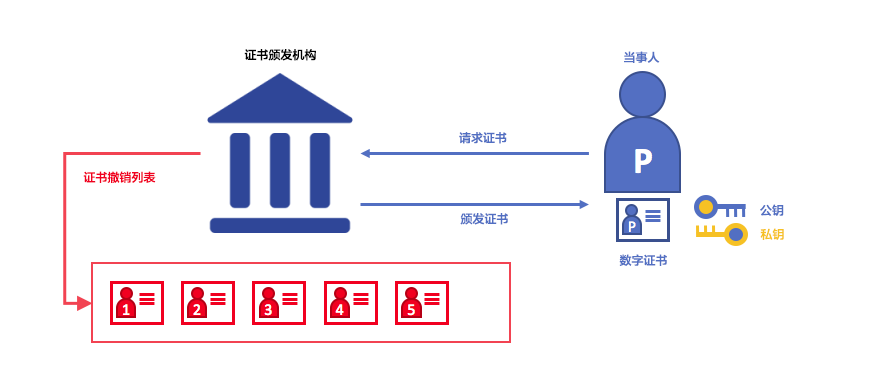
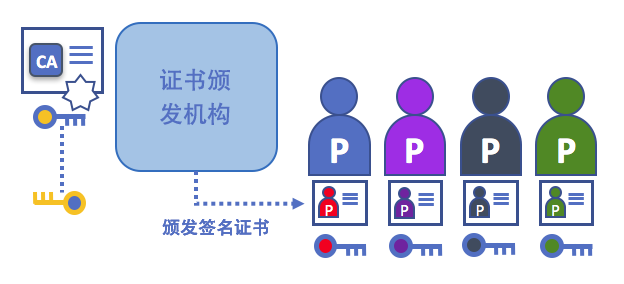

# 身份
# Identity

## 什么是身份
## What is an Identity?
在区块链的网络中有很多不同的身份包括节点（对等节点）、排序节点、客户端应用，超级管理员等等。它们中的每一个角色都拥有X.509数字证书封装的身份。而这些身份也因为**决定着角色在区块链网络中所能获得的资源权限**格外重要。
超级账本Fabric使用角色身份中的某些属性来确定权限，并称之为**当事人(principal)**，当事人就像是userIDs或者groupIDs这些，但是要更加灵活，它们可以包含角色的各种身份属性。当我们讨论当事人时，我们是在考虑系统中的角色，特别是可以决定它们权限的身份属性。这些属性通常是一个成员的组织，所属部门，承担角色或者其它成员的特殊身份。
The different actors in a blockchain network include peers, orderers, client applications,
administrators and more. Each of these actors has an identity that is encapsulated in an
X.509 digital certificate. These identities really matter because they **determine the exact
permissions over resources that actors have in a blockchain network.** Hyperledger Fabric uses
certain properties in an actor's identity to determine permissions, and it gives them a
special name -- a **principal**. Principals are just like userIDs or groupIDs, but a little
more flexible because they can include a wide range of an actor's identity properties.
When we talk about principals, we're thinking about the actors in the system --
specifically the actor's identity properties which determine their permissions. These
properties are typically the actor's organization, organizational unit, role or even the
actor's specific identity.

更为重要的是，**一个身份**必须是**可证实的**（即真实身份），因此它必须来源于一个能被系统信任的权威组织。在Fabric中[成员服务提供者](../membership/membership.html)(MSP，membership service provider)就是用来完成这件事情的。进一步来说，MSP是表示组织成员资格的组件，因此，它定义了管理该组织成员有效身份的规则。Fabric中默认的MSP方案使用X.509证书作为身份，并采用传统的公钥基础设施（PKI）分层模型。
Most importantly, **an identity** must be **verifiable** (a real
identity, in other words), and for this reason it must come from an
authority **trusted** by the system. A [membership service provider](../membership/membership.html)
(MSP) is the means to achieve this in Hyperledger Fabric. More specifically,
an MSP is a component that represents the membership rules of an organization,
and as such, it that defines the rules that govern a valid identity
of a member of this organization. The default MSP implementation in Fabric
uses X.509 certificates as identities, adopting a traditional Public
Key Infrastructure (PKI) hierarchical model.

## 使用身份的简单场景
## A Simple Scenario to Explain The Use of an Identity

想象这样一个场景：你到超市去买东西，在收银台你看到一个提醒说，只能使用Visa、Mastercard和AMEX银行卡，如果你试着使用其它卡片支付，让我们称它为“幻想卡”——即便这张卡真实且余额充足，也不行，它不会被接受。

Imagine that you visit a supermarket to buy some groceries. At the checkout you see
a sign that says that only Visa, Mastercard and AMEX cards are accepted. If you try to
 pay with a different card -- let's call it an "ImagineCard" -- it doesn't matter whether
 the card is authentic and you have sufficient funds in your account. It will be not be
 accepted.

*只拥有一个有效的信用卡还不够，还必须是商店可以接受的支付卡片才可以！PKIs和MSPs以相同的方式协同工作——PKI提供有效身份列表，MSP描述哪些身份是网络中给定组织的成员。*
*Having a valid credit card is not enough -- it must also be accepted by the store! PKIs
and MSPs work together in the same way -- PKI provides a list of identities,
and an MSP says which of these are members of a given organization that participates in
the network.*
PKI证书颁发机构和MSPs提供了类似的多功能组合，一个PKI就像是一种卡的提供商，它分配了很多不同的可验证身份，而一个MSP，从某个层面看，就像是商店接受的卡种提供商列表。决定着哪些身份在商店的支付网络中是可信的成员（角色）。**MSP将可验证的身份转换成了区块链网络中的成员**。
PKI certificate authorities and MSPs provide a similar combination of functionalities.
A PKI is like a card provider -- it dispenses many different types of verifiable
identities. An MSP, on the other hand, is like the list of card providers accepted
by the store -- determining which identities are the trusted members (actors)
of the store payment network. **MSPs turn verifiable identities into the members
of a blockchain network**.
下面让我们更详细的了解这些概念。
Let's drill into these concepts in a little more detail.

## 什么事PKIs
## What are PKIs?

**一个公钥基础设施（PKI）是在网络中提供安全通信的因特网技术的集合。**也正是PKI把**S**带给**HTTPS**的，如果你正在网络浏览器中读这篇文档，那么你很可能就在使用PKI去确认文档来源于一个可以验证的资源。

**A public key infrastructure (PKI) is a collection of internet technologies that provides
secure communications in a network.** It's PKI that puts the **S** in **HTTPS** -- and if
you're reading this documentation on a web browser, you're probably using a PKI to make
sure it comes from a verified source.

*公钥基础设施(PKI)原理。公钥基础设施由向成员（服务的使用者、服务的提供者）颁发数字证书的认证机构（CA）组成，然后这些成员使用数字证书去证明他们在环境中交换的消息确实由该成员所发，一个CA的证书撤销列表（CRL）由无效数字证书的引用组成。证书的吊销可能有很多原因，比如，与证书关联的私有信息（私钥等）已经泄漏，那么证书就应该被吊销。*
*The elements of Public Key Infrastructure (PKI). A PKI is comprised of Certificate
Authorities who issue digital certificates to parties (e.g., users of a service, service
provider), who then use them to authenticate themselves in the messages they exchange
with their environment. A CA's Certificate Revocation List (CRL) constitutes a reference
for the certificates that are no longer valid. Revocation of a certificate can happen fora number of reasons. For example, a certificate may be revoked because the cryptographic
private material associated to the certificate has been exposed.

虽然区块链网络不只是通信网络，它依赖于PKI标准来确保在各种多样的网络间加密通信，同时确保发布在区块链上的消息都是被正确认证的。因此理解PKI的基础概念十分重要，进而MSPs也很重要。
Although a blockchain network is more than a communications network, it relies on the
PKI standard to ensure secure communication between various network participants, and to
ensure that messages posted on the blockchain are properly authenticated.
It's therefore really important to understand the basics of PKI and then why MSPs are
so important.

PKI有四个关键的元素：

 * **数字证书**
 * **公钥、私钥**
 * **认证机构**
 * **证书吊销列表**
There are four key elements to PKI:

 * **Digital Certificates**
 * **Public and Private Keys**
 * **Certificate Authorities**
 * **Certificate Revocation Lists**

让我们快速介绍一下这些PKI的基本要素，如果你还想知道更多细节，[Wikipedia](https://en.wikipedia.org/wiki/Public_key_infrastructure)是个开始的好地方。
Let's quickly describe these PKI basics, and if you want to know more details,
[Wikipedia](https://en.wikipedia.org/wiki/Public_key_infrastructure) is a good place to start.

## 数字证书
## Digital Certificates

数字证书是一份保存了成员相关的一系列属性的文件。最通用的数字证书类型满足[X.509 标准](https://en.wikipedia.org/wiki/X.509),该标准允许在其结构中编码成员的身份识别细节。举例来说，张三（原文是John Doe，英语中意为某人）是美国密西根省底特律市FOO公司会计部的员工，他可能有这样的数字证书：`主题属性`：`C=美国, ST=密西根，L=底特律，O=FOO公司，OU=会计部，CN=张三，UID=123456`.张三的数字证书和他的官方身份卡是相似的，它提供张三的信息，张三可以使用这些信息来证明关于他的一些关键事实，在X.509中还有很多其它的属性，但目前我们只关注这些就够了。
A digital certificate is a document which holds a set of attributes relating to a
party. The most common type of certificate is the one compliant with the [X.509 standard](https://en.wikipedia.org/wiki/X.509),
which allows the encoding of a party's identifying details in its structure.
For example, John Doe of Accounting division in
FOO Corporation in Detroit, Michigan might have a digital certificate with a
`SUBJECT` attribute of `C=US, ST=Michigan, L=Detroit, O=FOO Corporation, OU=Accounting,
CN=John Doe /UID=123456`. John's certificate is similar to his government identity
card -- it provides information about John which he can use to prove key facts about him.
There are many other attributes in an X.509 certificate, but let's concentrate
on just these for now.

*关于某个成员的数字证书，某人是证书的“主题”，“主题”中加粗的文本显示了关于他的关键事实。如您所见，该证书还保存了更多的信息。最重要的是，此人的公钥信息也发布在他的证书中，而他的私钥不在其中，私钥是必须保密的。*
*A digital certificate describing a party called John Doe. John is the `SUBJECT` of the
certificate, and the highlighted `SUBJECT` text shows key facts about John. The
certificate also holds many more pieces of information, as you can see. Most importantly,
John's public key is distributed within his certificate, whereas his private signing key
is not. This signing key must be kept private.*

重要的是张三的所有属性都可以使用一种称为密码学的数学技术来记录（书面语，“*密写*”）也因为这样，对属性的篡改会使证书失效。密码学使得张三可以向他人出示数字证书来证明身份，只要其它人能够信任证书颁发者，也就是**证书颁发机构**（CA）。只要CA可以隐秘的保存确定的密文信息（意思是，它自己的**私有签名密钥**），任何读取证书的人都可以确信，这些信息就是张三的，它没有被篡改。可以把上图里Mary的X.509证书看作是一个不可更改的数字身份证。
What is important is that all of John's attributes can be recorded using a mathematical
technique called cryptography (literally, "*secret writing*") so that tampering will
invalidate the certificate. Cryptography allows John to present his certificate to others
to prove his identity so long as the other party trusts the certificate issuer, known
as a **Certificate Authority** (CA). As long as the CA keeps certain cryptographic
information securely (meaning, its own **private signing key**), anyone reading the
certificate can be sure that the information about John has not been tampered with --
it will always have those particular attributes for John Doe. Think of Mary's X.509
certificate as a digital identity card that is impossible to change.

## 身份验证 \& 公钥和私钥
## Authentication \& Public keys and Private Keys

身份验证和消息完整性是安全通信的重要概念。身份验证要求各方创建特定消息来确保消息交换者的身份。完整性要求在传输过程中不修改消息。例如，您可能希望确保与真正的张三通信而不是模仿者。或者可能希望确保他向您发送的一条消息，在传输过程中没有被任何人篡改过。
Authentication and message integrity are important concepts of secure
communication. Authentication requires that parties who exchange messages
can be assured of the identity that created a specific message. Integrity
requires that the message was not modified during its transmission.
For example, you might want to be sure you're communicating with the real John
Doe than an impersonator. Or if John has sent you a message, you might want to be sure
that it hasn't been tampered with by anyone else during transmission.

传统的身份验证机制依赖于**数字签名机制**，顾名思义，允许一方对其消息进行数字**签名**。数字签名还可以保证签名消息的完整性。
Traditional authentication mechanisms rely on **digital signature mechanisms**, that
as the name suggests, allow a party to digitally **sign** its messages. Digital
signatures also provide guarantees on the integrity of the signed message.

从技术上讲，数字签名机制要求每一方都需要保存两个加密有关联的密钥：广泛公开使用的公钥，充当身份验证依据，以及用于在消息上生成**数字签名**的私钥。 消息的接收者可以通过检查消息的附加数字签名，是否在预期发送者的公钥下有效，来验证接收到的消息来源和完整性。
Technically speaking, digital signature mechanisms require require for each party to
hold two cryptographically connected keys: a public key that is made widely available,
and acts as authentication anchor, and a private key that is used to produce
**digital signatures** on messages. Recipients of digitally signed messages can verify
the origin and integrity of a received message by checking that the
attached signature is valid under the public key of the expected sender.

**私钥和对应公钥的独特关系是密码学的魔术，这使得加密通信成为可能**。密钥之间的唯一数学关系让私钥可以用于消息签名，这一签名仅有对应的公钥和相同的签名信息可以正确匹配。
**The unique relationship between a private key and the respective public key is the
cryptographic magic that makes secure communications possible**. The unique
mathematical relationship between the keys is such that the private key can be used to
produce a signature on a message that only the corresponding public key can match, and
only on the same message.

在上面的示例中，为了验证他的消息，Mary使用她的私钥在消息上生成签名，然后将其附加到消息中，任何使用Mary的公钥查看签名消息的人都可以验证签名真伪。
In the example above, to authenticate his message Joe uses his private key to produce a
signature on the message, which he then attaches to the message. The signature
can be verified by anyone who sees the signed message, using John's public key.

## 认证机构
## Certificate Authorities

如您所见，成员或者说节点能够通过区块链网络所信任的机构为其发布的**数字身份**加入到网络中。在最常见的情况下，数字身份（或简称**身份**）具有符合X.509标准的加密验证数字证书的形式，并由证书颁发机构（CA）颁发。
As you've seen, an actor or a node is able to participate in the blockchain network,
via the means of a **digital identity** issued for it by an authority trusted by the
system. In the most common case, digital identities (or simply **identities**) have
the form of cryptographically validated digital certificates that comply with X.509
standard, and are issued by a Certificate Authority (CA).

CA是互联网安全协议的常见部分，您可能已经听说过一些比较流行的协议：Symantec（最初是Verisign），GeoTrust，DigiCert，GoDaddy和Comodo等。
CAs are a common part of internet security protocols, and you've probably heard of
some of the more popular ones: Symantec (originally Verisign), GeoTrust, DigiCert,
GoDaddy, and Comodo, among others.

证书颁发机构向不同的参与者分发证书。 这些证书由CA进行数字签名（即使用CA的私钥），同时将实际的用户角色与该用户的公钥绑定在一起，并可选地与一个完整的属性列表绑定在一起。显然，如果一个人信任CA（并且知道其公钥），它可以（通过验证参与者证书上的CA签名）信任特定参与者绑定到证书中包含的公钥，并拥有包含的属性。
*A Certificate Authority dispenses certificates to different actors. These certificates
are digitally signed by the CA (i.e, using the CA's private key), and
bind together the actual actor with the actor's  public key, and optionally with a
comprehensive list of properties. Clearly, if one trust the CA (and
knows its public key), it can (by validating the CA's signature on the actor's
certificate) trust that the specific actor is bound to the public key included in the
certificate, and owns the included attributes.

至关重要的，证书因为并不包含角色信息和角色的私钥，因此可以广泛传播，这也就使得证书能够当做信任的锚点，来验证来自不同角色的消息。
Crucially certificates can be widely disseminated, as they do not include neither the
actors' nor the actual CA's private keys. As such they can be used as anchor of
trusts for authenticating messages coming from different actors.

事实上，证书颁发机构本身也有证书，它们被广泛使用。这允许由CA颁发身份的使用者们通过检查证书，来验证只能由相应私钥的持有者生成。
In reality, CAs themselves also have a certificate, which they make widely
available. This allows the consumers of identities issued by a given CA to
verify them by checking that the certificate could only have been generated
by the holder of the corresponding private key (the CA).

在区块链的设置中，每个希望与网络进行交互的参与者都需要有身份。在这样的设置下，可以说有**一个或多个CA**可以用于**从数字角度定义组织的成员**。
CA为组织的参与者提供可验证的数字身份的基础。
In the Blockchain setting, every actor who wishes to interact with the network
needs an identity. In this setting,  you might say that **one or more CAs** can be used
to **define the members of an organization's from a
digital perspective**. It's the CA that provides the basis for an
organization's actors to have a verifiable digital identity.

### 根CA，中间CA和信任链
### Root CAs, Intermediate CAs and Chains of Trust

CA有两种形式：根CA和中间CA。由于根CA（赛门铁克、Geotrust等等)必须安全地向互联网用户颁发数以亿计个证书，因此将此过程分散到所谓的**中间CA**是有意义的。这些中间CA具有由根CA或其他中间机构颁发的证书，允许为链中的任何CA颁发的任何证书建立“信任链”。追溯到根CA的这种能力不仅提供了CA的功能扩展，同时依然提供安全性，这样的特点让组织能够有信心地使用中间CA所颁发的证书。此外它还限制了根CA的暴露，根CA如果受到损害，会危及整个信任链。而另一方面，如果是中间CA受到损害，则曝露范围会小得多。

CAs come in two flavors: **Root CAs** and **Intermediate CAs**. Because Root CAs
(Symantec, Geotrust, etc) have to **securely distribute** hundreds of millions
of certificates to internet users, it makes sense to spread this process out
across what are called *Intermediate CAs*. These Intermediate CAs
have their certificates issued by the root CA or another intermediate authority,
allowing the establishment of a "chain of trust" for any certificate
that is issued by any CA in the chain. This ability to track back to the Root
CA not only allows the function of CAs to scale while still providing security
-- allowing organizations that consume certificates to use Intermediate CAs with
confidence -- it limits the exposure of the Root CA, which, if compromised, would
endanger the entire chain of trust. If an Intermediate CA is compromised, on the
other hand, there is a much smaller exposure.

*只要中间CA的证书全是由根CA本身颁发或具有到根CA的信任链，那么就可以在根CA和这样的一组中间CA之间建立信任链。*

*A chain of trust is established between a Root CA and a set of Intermediate CAs
as long as the issuing CA for the certificate of each of these Intermediate CAs is
either the Root CA itself or has a chain of trust to the Root CA.*

中间CA在跨多个组织颁发证书时提供了巨大的灵活性，这在有许可的区块链系统中非常有用。例如，您将看到不同的组织可能使用不同的根CA，或者使用具有不同中间CA的相同根CA，这些取决于网络的需求。
Intermediate CAs provide a huge amount of flexibility when it comes to the issuance
of certificates across multiple organizations, and that's very helpful in a
permissioned blockchain system. For example, you'll see that different organizations
may use different Root CAs, or the same Root CA with different Intermediate CAs --
it really does depend on the needs of the network.

### Fabric CA

因为CA确实太重要了，Fabric提供了内置的CA组件供你在构建区块链网络的时候创建CA。这个组件（** fabric-ca **）是一个私有根CA的提供者程序，能够管理具有X.509证书形式的Fabric参与者的数字身份。由于Fabric-CA是针对Fabric的根CA需求而自定义的特别CA，因此它本身无法为浏览器中的常规或自动使用，提供SSL证书。 但是，因为**必须使用某些** CA来管理身份（即使在测试环境中）,fabric-ca可以用来提供和管理证书。使用公共/商业根或中间CA来提供识别也是可以的，并且完全合适。
It's because CAs are so important that Fabric provides a built-in CA component to
allow you to create CAs in the blockchain networks you form. This component -- known
as **fabric-ca** is a private root CA provider capable of managing digital identities of
Fabric participants that have the form of X.509 certificates.
Because Fabric-CA is a custom CA targetting the Root CA needs of Fabric,
it is inherently not capable of providing SSL certificates for general/automatic use
in browsers. However, because **some** CA must be used to manage identity
(even in a test environment), fabric-ca can be used to provide and manage
certificates. It is also possible -- and fully appropriate -- to use a
public/commerical root or intermediate CA to provide identification.

如果你对这些感兴趣，你可以从[CA文档章节](http://hyperledger-fabric-ca.readthedocs.io/)中阅读到更多关于fabric-ca的内容。

If you're interested, you can read a lot more about fabric-ca

## 证书废弃列表
## Certificate Revocation Lists

证书废弃列表（CRL）很容易理解——它是一个关于CA已知的因为某种原因而弃用的证书列表，如果你能回忆起商店的那个场景，证书废弃列表就像是被盗信用卡列表一样。
A Certificate Revocation List (CRL) is easy to understand -- it's just a list of
references to certificates that a CA knows to be revoked for one reason or another. If you recall
the store scenario, a CRL would be like a list of stolen credit cards.

当一个第三方想要验证另一方的身份时，它会先检查证书颁发机构的CRL，来确认该身份证书没有被吊销。验证者不是必须检查CRL，如果他们可以冒着接受来自受损身份的风险。

When a third party wants to verify another party's identity, it first checks the
issuing CA's CRL to make sure that the certificate has not been revoked.
A verifier doesn't have to check the CRL, but if they don't they run the risk of
accepting a compromised identity.

*使用CRL检查证书是否仍然有效。如果模仿者试图将受损的数字证书传递给验证方，则可以首先检查颁发CA的CRL，以确保其未被列为不再有效。*

*Using a CRL to check that a certificate is still valid. If an impersonator tries to
pass a compromised digital certificate to a validating party, it can be first
checked against the issuing CA's CRL to make sure it's not listed as no longer valid.*

请注意，被撤销的证书与证书过期非常不同。撤销的证书尚未过期 - 按其他措施，它们是完全有效的证书。 这类似于过期驾驶执照和被吊销驾驶执照之间的差异。有关CRL的更深入信息，请点击[这里](https://hyperledger-fabric-ca.readthedocs.io/en/latest/users-guide.html#generating-a-crl-certificate-revocation-list)。

Note that a certificate being revoked is very different from a certificate expiring.
Revoked certificates have not expired -- they are, by every other measure, a fully
valid certificate. This is similar to the difference between an expired driver's license
 and a revoked driver's license. For more in depth information into CRLs, click [here](https://hyperledger-fabric-ca.readthedocs.io/en/latest/users-guide.html#generating-a-crl-certificate-revocation-list).

您已经了解了PKI如何通过信任链提供可验证的身份，下一步是了解这些身份如何用于代表区块链网络的可信成员。这就是成员服务提供者（MSP）发挥作用的地方——**它确定了区块链网络中特定组织成员的各方**。
Now that you've seen how a PKI can provide verifiable identities through a chain of
trust, the next step is to see how these identities can be used to represent the
trusted members of a blockchain network. That's where a Membership Service Provider
(MSP) comes into play -- **it identifies the parties who are the members of a given organization in the blockchain network**.

想要学习更多关于成员的内容，可以查阅[MSPs](../membership/membership.html)的概念文档。
To learn more about membership, check out the conceptual documentation on [MSPs](../membership/membership.html).

<!---
Licensed under Creative Commons Attribution 4.0 International License https://creativecommons.org/licenses/by/4.0/
-->
